# 커피원두 및 부자재 납품업체 영업ERP 서비스 (웹사이트)

## 목차
1. [개요]
2. [개발 일정]
3. [팀원 구성]
4. [개발환경 및 기술스택]
5. [화면구상(Figma)]
6. [ERD/프로세스]
7. [화면UI]
8. [프로젝트 발표 ppt]

 

## 개요

## 개발 일정
: 2024/09/02 ~ 2024/09/27
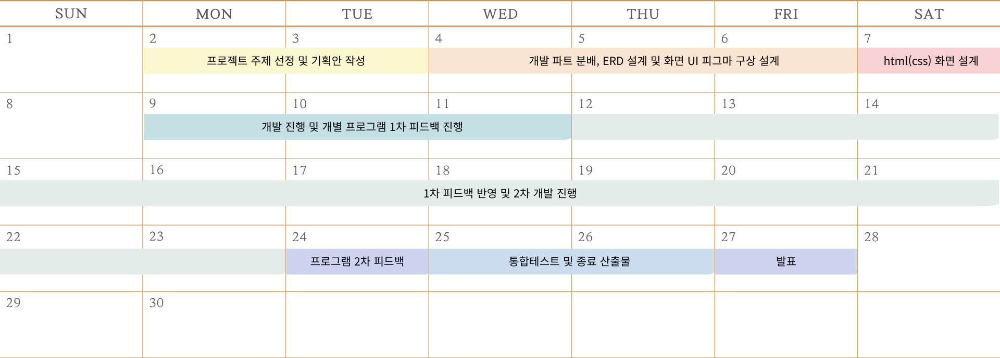  

 

## 팀원 구성

| **김수현** | **강현구** | **홍나린** | **신지윤** | **최해찬** | **남상혁** |
| :------: | :------: | :------: | :------: | :------: | :------: |
| [   @shyunu](https://github.com/shyunu) | [   @Hyeongu02](https://github.com/Hyeongu02) | [   @Hong-NaRin](https://github.com/Hong-NaRin) | [   @jishin14](https://github.com/jishin14) | [   @whfh3832](https://github.com/whfh3832) | [   @sxxxhyuk](https://github.com/sxxxhyuk) |
| 역할 | 역할 | 역할 | 역할 | 역할 | 역할 |
| 상품 가격 계약 시스템 구현   상품 판매 시스템 구현   프론트엔드 디자인 총괄   결과 PPT 제작 | 시큐리티 권한 기능 구현   사원 시스템 구현   부서 시스템 구현   결과보고서 워드 작성 | 공급업체 시스템 구현   상품 구매 시스템 구현   프론트엔드 디자인 총괄   결과 PPT 제작 | 상품 시스템 구현   상품 구매 시스템 구현   상품 가격 계약 시스템 구현   영상시나리오 작성 | 메인페이지 구현   부서 시스템 구현   결과보고서 워드 작성 | 계약 프로세스 구현   상품 판매 시스템 구현   시연 영상 제작 |

 

## 개발 환경 및 기술 스택

| 항목 | 내용 |
|---|---|
| **프로그래밍 언어** | Java 11 |
| **프론트엔드** | React 18.3.1 ,Thymeleaf |
| **프레임워크** | Spring Boot 2.7.18 |
| **보안** | Spring Security |
| **빌드 도구** | gradle-8.1 |
| **데이터베이스(DB)** | PostgreSQL 16.3 (AWS RDS) |
| **데이터베이스 연동** | MyBatis |
| **개발 도구(IDE)** | IntelliJ IDEA, VSCode |
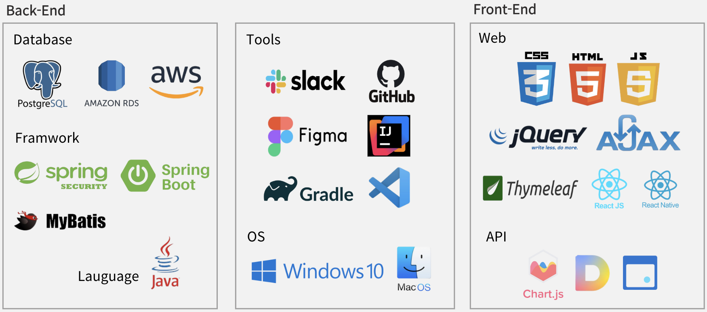  

 

## 화면구상(Figma)
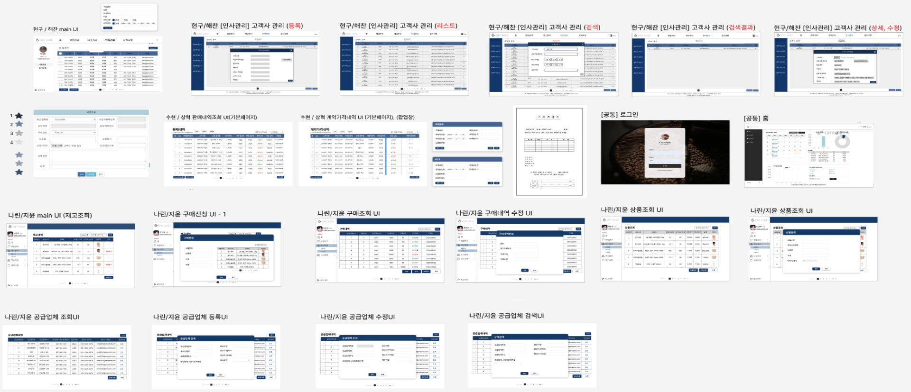  

 

## ERD/프로세스

  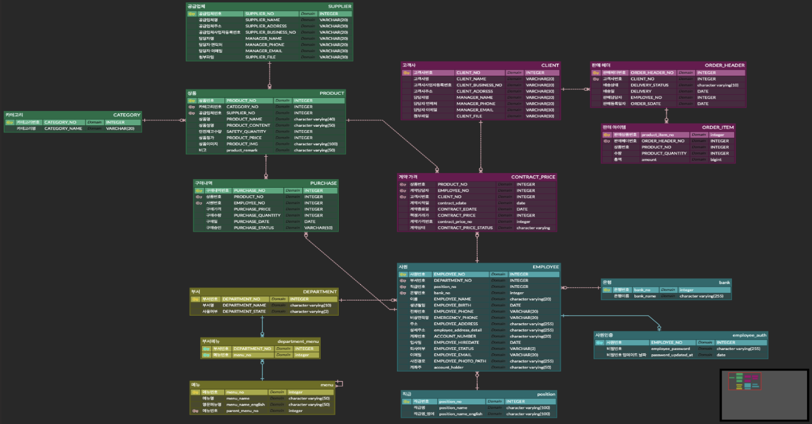
  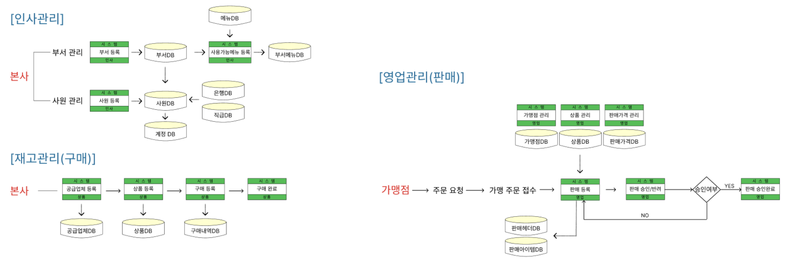

 

## 화면 UI
## 1. 로그인 및 홈

### 1-1. 로그인 화면

  

📍 **본사 직원이 로그인하는 화면입니다.**

 

### 1-2. 메인 홈 화면

  

📍 **Oneshot ERP 메인 화면**  
연차(휴가제도)를 사용한 직원의 일정, 분기별 매출액, 목표판매량 도달률, 사원수, 사내 규정 등의 정보를 확인할 수 있습니다.

## 2. 인사관리 - 부서관리

### 2-1. 부서 등록 화면

  

📍 **부서 등록 화면**  
부서명을 입력하고 사용 가능 메뉴를 선택하면 해당 메뉴에 대해서만 사용 권한이 부여됩니다.

 

### 2-2. 부서 조회 화면

  

📍 **등록된 부서를 확인할 수 있는 화면입니다.**

 

### 2-3. 부서 내 직원 조회 화면

  

📍 **해당 부서의 직원 리스트를 확인할 수 있는 화면입니다.**

 

### 2-4. 부서 상태 변경 화면

  

📍 **부서의 사용가능메뉴를 변경 및 활성화 여부를 설정하는 화면입니다.**

## 3. 인사관리 - 사원관리

### 3-1. 사원 등록 화면

  

📍 **사원 등록 화면**  
양식에 맞게 정보를 입력하여 사원을 등록할 수 있습니다.

 

### 3-2. 직원 퇴직 처리 화면

  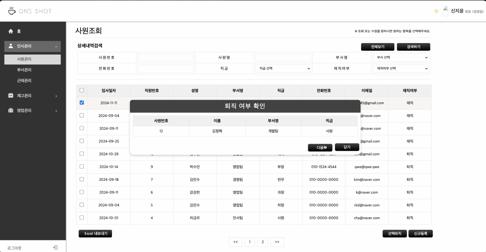

📍 **직원 퇴직 처리 화면입니다.**

## 4. 인사관리 - 근태관리

### 4-1. 휴가 신청 화면

  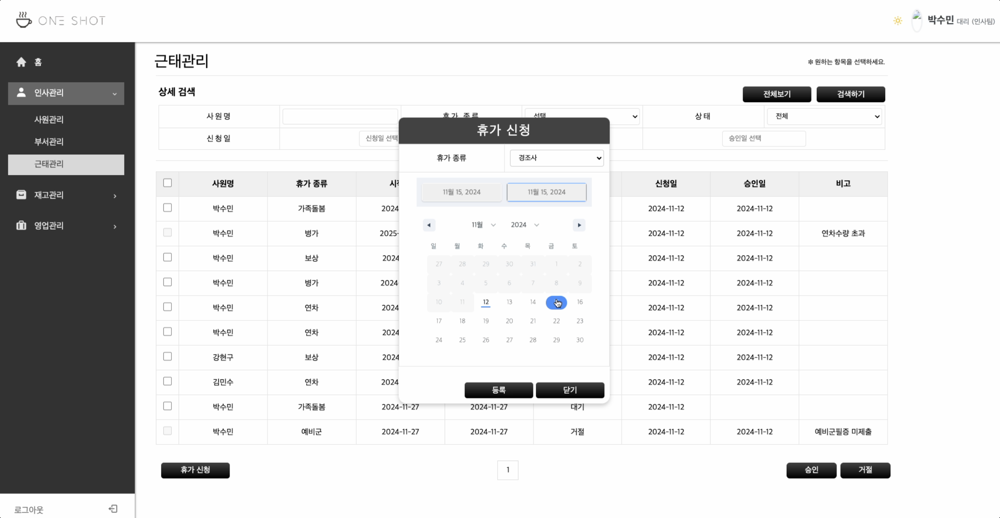

📍 **휴가 신청 화면**  
휴가의 종류 및 휴가 시작일과 종료일을 선택하여 휴가를 신청할 수 있습니다.

 

### 4-2. 휴가 승인 화면

  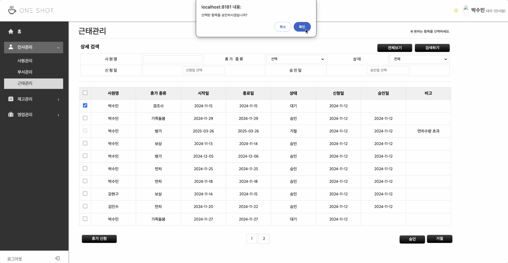

📍 **휴가 승인 화면입니다.**
승인하고자 하는 항목을 체크하여 승인을 할 수 있습니다.

 

### 4-3. 휴가 반려 화면

  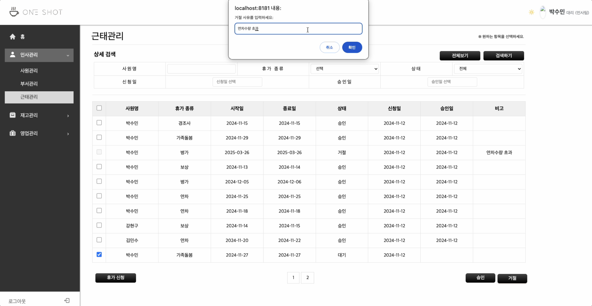

📍 **휴가 반려 화면입니다.**
신청된 휴가를 반려하고자 하면 반려 사유를 작성하여 반려 처리 가능합니다.

## 5. 재고관리 - 공급업체관리

### 5-1. 공급업체 등록 화면

  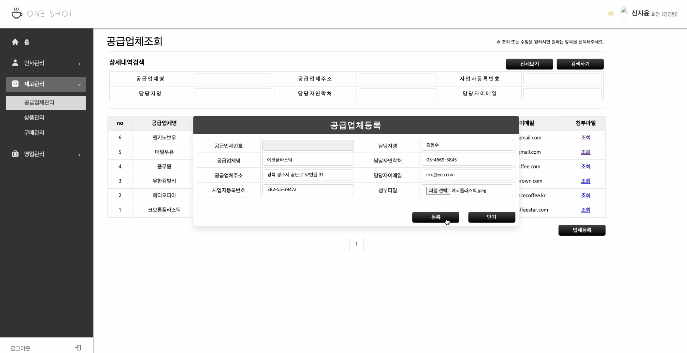

📍 **공급업체 등록 화면**  
양식에 맞게 작성하여 공급업체를 작성할 수 있습니다.

 

### 5-2. 공급업체 조회 및 수정 화면

  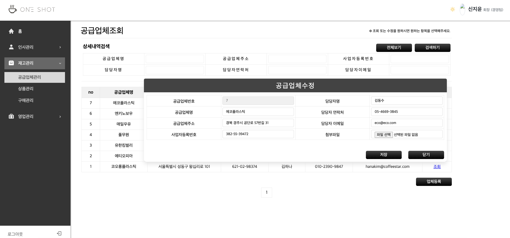

📍 **공급업체 조회 및 수정 화면입니다.**
등록한 공급업체의 정보를 조회 및 수정할 수 있습니다.

## 6. 재고관리 - 상품관리

### 6-1. 상품 등록 화면

  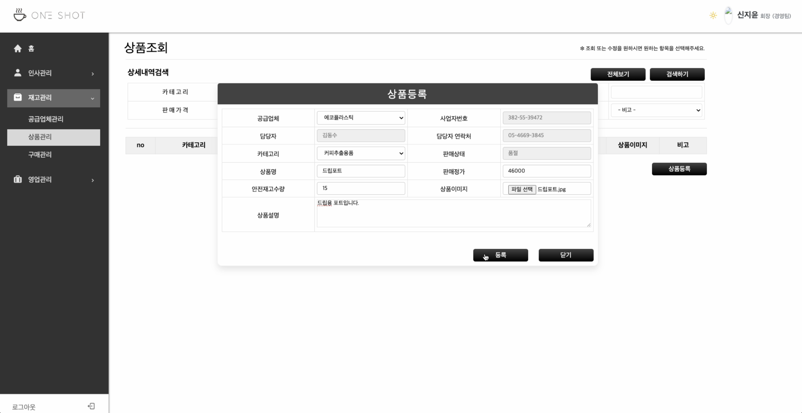

📍 **상품 등록 화면**  
양식에 맞게 작성하여 상품을 작성할 수 있습니다.

 

### 6-2. 상품 조회 화면

  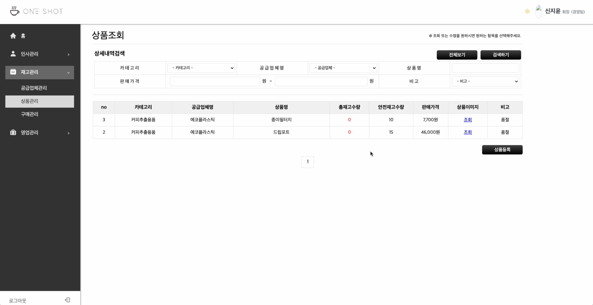

📍 **상품 조회 화면입니다.**
등록한 상품의 정보를 조회할 수 있습니다.

## 7. 재고관리 - 구매관리

### 7-1. 구매 등록 화면

  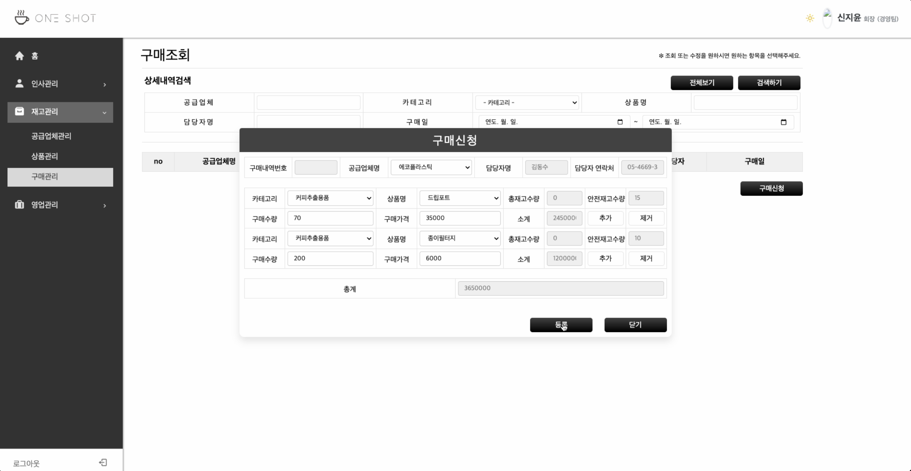

📍 **구매 등록 화면**  
구매양식에 맞게 작성하여 공급업체로부터 상품을 구매할 수 있습니다.

 

### 7-2. 구매 후 재고 조회 화면

  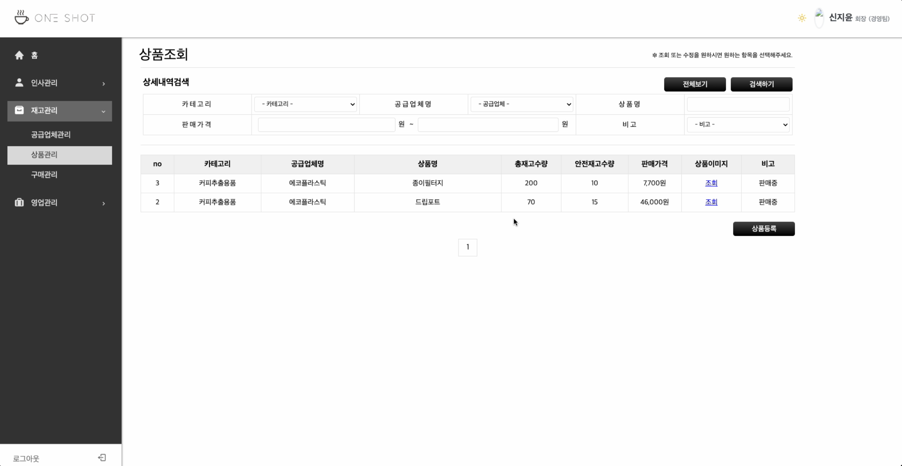

📍 **구매 후 재고 조회 화면입니다.**
구매한 상품의 개수만큼 재고가 생성된 것을 확인할 수 있습니다.

## 8. 영업관리 - 계약관리

### 8-1. 계약 등록 화면

  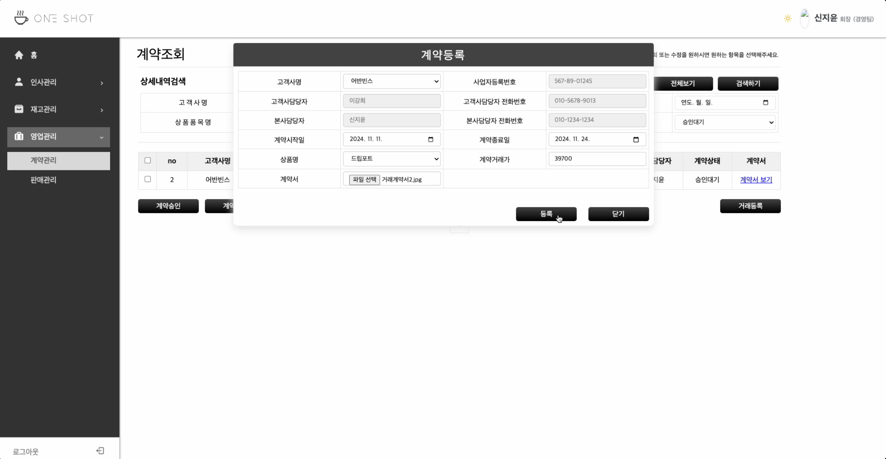

📍 **계약 등록 화면**  
고객사와의 계약을 통하여 계약 기간동안 계약가격으로 고객사와 거래할 수 있습니다. 그에 맞는 계약을 등록하는 과정입니다.

 

### 8-2. 계약 승인 화면

  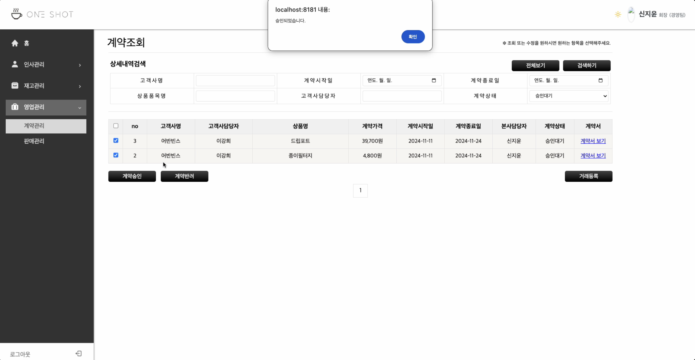

📍 **계약 승인 화면입니다.**
승인하고자 하는 계약을 선택하여 승인 처리합니다.

 

### 8-3. 계약서 저장 화면

  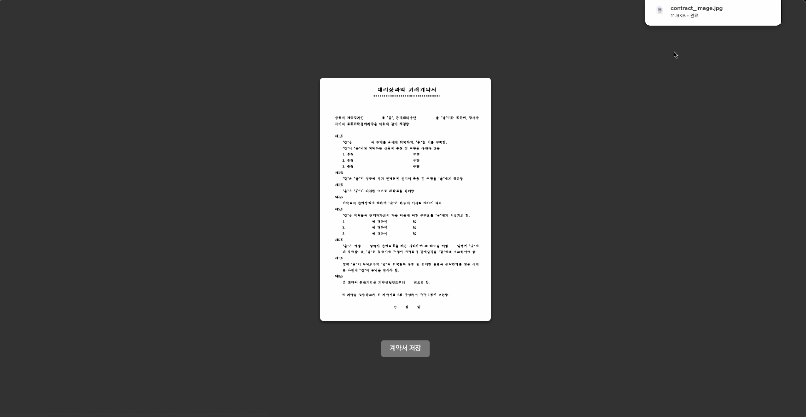

📍 **계약서 저장 화면입니다.**
계약 등록 시 첨부한 계약서를 조회 및 저장할 수 있습니다.

## 9. 영업관리 - 판매관리

### 9-1. 판매 등록 화면

  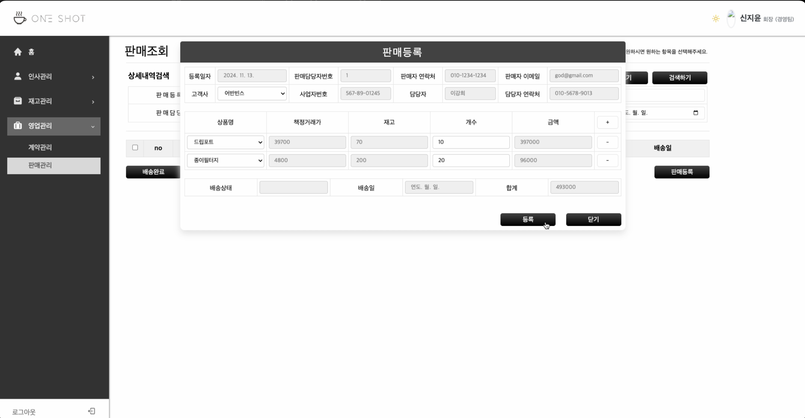

📍 **판매 등록 화면**  
고객사와 상품를 선택하면 승인된 계약건에 해당하는 계약가격이 자동으로 나타나게 되며 판매한 상품을 여러개 등록할 수 있습니다.

 

### 9-2. 판매 상세조회 화면

  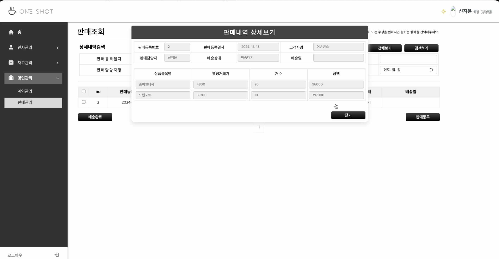

📍 **판매 상세조회 화면입니다.**
판매 등록건을 상세 조회할 수 있는 화면입니다.

 

### 9-4. 판매 배송처리 화면

  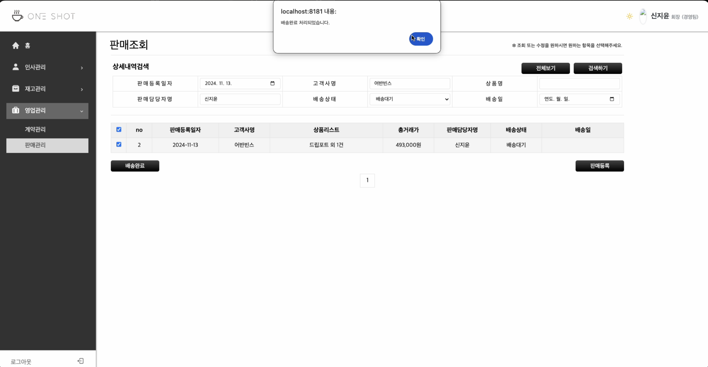

📍 **판매 배송처리 화면입니다.**
판매 등록건을 배송처리할 수 있습니다.

 

## 프로젝트 발표 ppt
