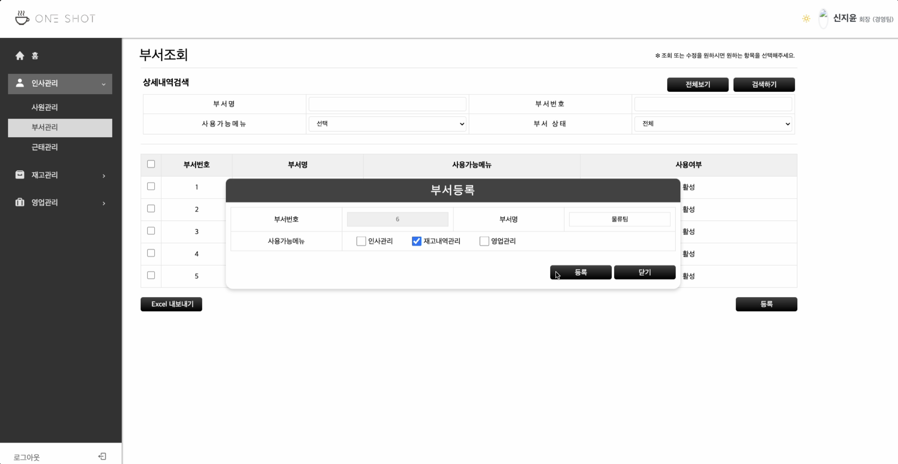
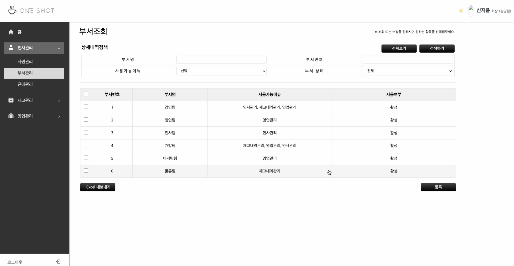
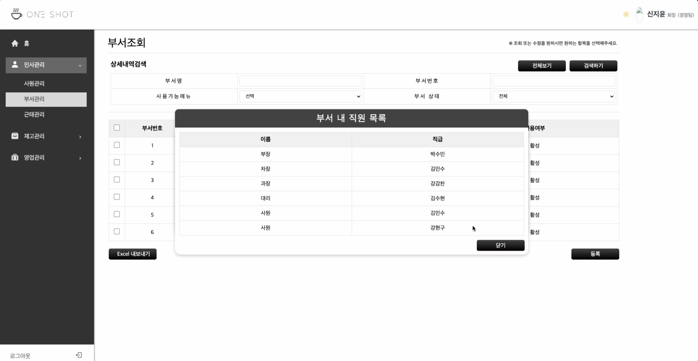
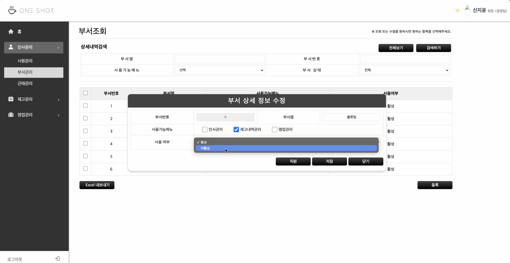
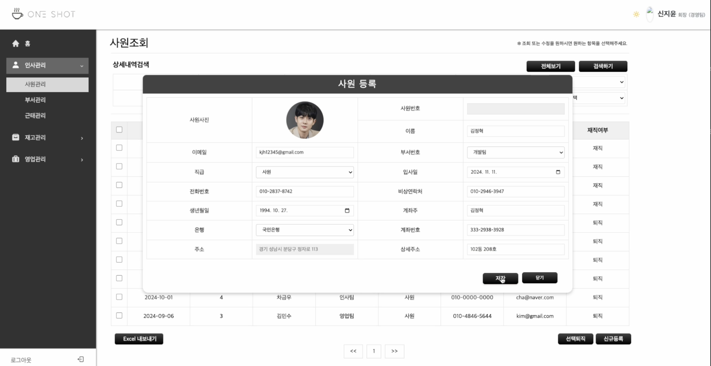

# 커피원두 및 부자재 납품업체 영업ERP 서비스 (웹사이트)

- **개발 기간** : 2024/09/02 ~ 09/27

 
  
## 개발 환경 및 기술 스택

| 항목 | 내용 |
|---|---|
| **프로그래밍 언어** | Java 11 |
| **프론트엔드** | React 18.3.1 ,Thymeleaf |
| **프레임워크** | Spring Boot 2.7.18 |
| **보안** | Spring Security |
| **빌드 도구** | gradle-8.1 |
| **데이터베이스(DB)** | PostgreSQL 16.3 (AWS RDS) |
| **데이터베이스 연동** | MyBatis |
| **개발 도구(IDE)** | IntelliJ IDEA, VSCode |

 

## 팀원 구성

| **김수현** | **강현구** | **홍나린** | **신지윤** | **최해찬** | **남상혁** |
| :------: | :------: | :------: | :------: | :------: | :------: |
| [   @shyunu](https://github.com/shyunu) | [   @Hyeongu02](https://github.com/Hyeongu02) | [   @Hong-NaRin](https://github.com/Hong-NaRin) | [   @jishin14](https://github.com/jishin14) | [   @whfh3832](https://github.com/whfh3832) | [   @sxxxhyuk](https://github.com/sxxxhyuk) |

 

# 프로젝트 구현 화면

## 1. 로그인 및 홈

### 1-1. 로그인 화면

  

📍 **본사 직원이 로그인하는 화면입니다.**

 

### 1-2. 메인 홈 화면

  

📍 **Oneshot ERP 메인 화면**  
연차(휴가제도)를 사용한 직원의 일정, 분기별 매출액, 목표판매량 도달률, 사원수, 사내 규정 등의 정보를 확인할 수 있습니다.

## 2. 인사관리 - 부서관리

### 2-1. 부서 등록 화면

  

📍 **부서 등록 화면**  
부서명을 입력하고 사용 가능 메뉴를 선택하면 해당 메뉴에 대해서만 사용 권한이 부여됩니다.

 

### 2-2. 부서 조회 화면

  

📍 **등록된 부서를 확인할 수 있는 화면입니다.**

 

### 2-3. 부서 내 직원 조회 화면

  

📍 **해당 부서의 직원 리스트를 확인할 수 있는 화면입니다.**

 

### 2-4. 부서 상태 변경 화면

  

📍 **부서의 사용가능메뉴를 변경 및 활성화 여부를 설정하는 화면입니다.**

## 3. 인사관리 - 사원관리

### 3-1. 사원 등록 화면

  

📍 **사원 등록 화면**  
양식에 맞게 정보를 입력하여 사원을 등록할 수 있습니다.
