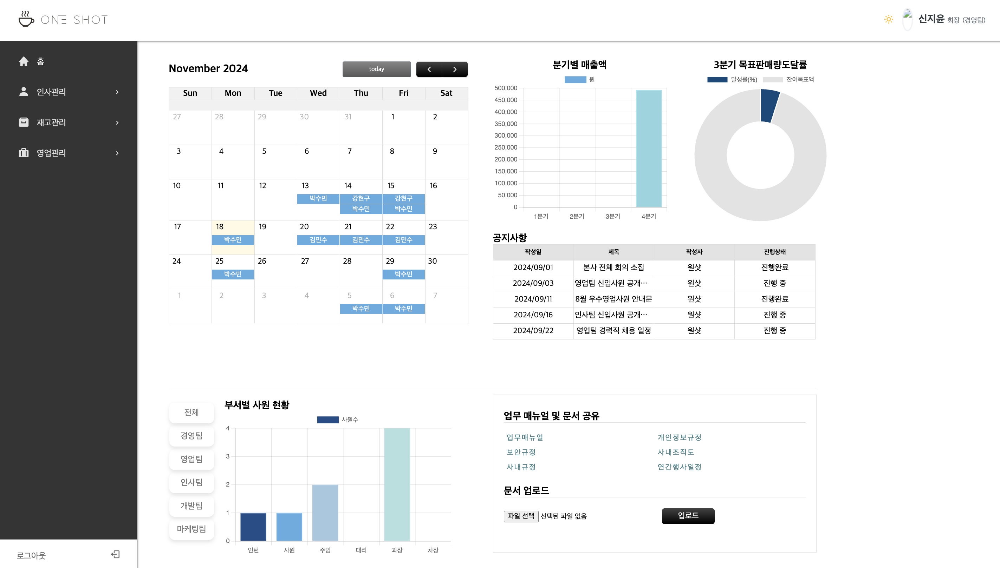

# 커피원두 및 부자재 납품업체 영업ERP 서비스 (웹사이트)

- **개발 기간** : 2024/09/02 ~ 09/27

 
  
## 개발 환경 및 기술 스택

| 항목 | 내용 |
|---|---|
| **프로그래밍 언어** | Java 11 |
| **프론트엔드** | React 18.3.1 ,Thymeleaf |
| **프레임워크** | Spring Boot 2.7.18 |
| **보안** | Spring Security |
| **빌드 도구** | gradle-8.1 |
| **데이터베이스(DB)** | PostgreSQL 16.3 (AWS RDS) |
| **데이터베이스 연동** | MyBatis |
| **개발 도구(IDE)** | IntelliJ IDEA, VSCode |

 

## 팀원 구성

| **김수현** | **강현구** | **홍나린** | **신지윤** | **최해찬** | **남상혁** |
| :------: | :------: | :------: | :------: | :------: | :------: |
| [   @shyunu](https://github.com/shyunu) | [   @Hyeongu02](https://github.com/Hyeongu02) | [   @Hong-NaRin](https://github.com/Hong-NaRin) | [   @jishin14](https://github.com/jishin14) | [   @whfh3832](https://github.com/whfh3832) | [   @sxxxhyuk](https://github.com/sxxxhyuk) |

 

## 프로젝트 구현 화면

### 로그인 화면

📍 본사 직원이 로그인하는 화면입니다.

### 로그인 화면

📍 oneshot ERP 메인 화면입니다.
